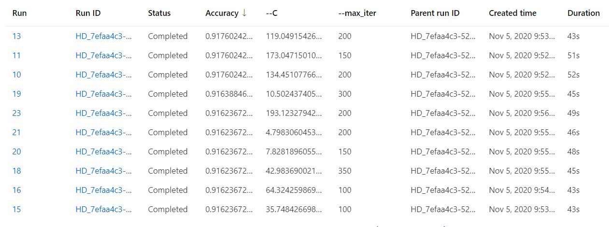
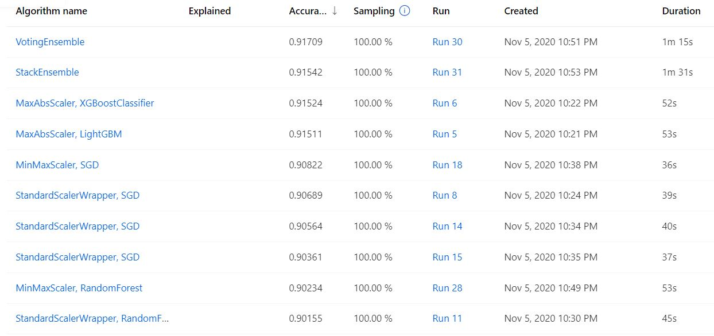

# Optimizing an ML Pipeline in Azure

## Overview
This project is part of the Udacity Azure ML Nanodegree.
In this project, we build and optimize an Azure ML pipeline using the Python SDK and a provided Scikit-learn model.
This model is then compared to an Azure AutoML run.

## Summary
Provided data set 'bankmarketing_train.csv' contains clients data of a Portuguese banking institution relate to  direct marketing campaigns (phone calls).
We see to predict if if the client will subscribe a term deposit (column 'y)'.

The best performing model with the accuracy of *91,76024%* is LogisticRegression from the HyperDrive pipeline.

## Scikit-learn Pipeline

We are training multiple scikit-learn [LogisticRegression]([LogisticRegression](https://scikit-learn.org/stable/modules/generated/sklearn.linear_model.LogisticRegression.html)) models with different values of the `-C`(Inverse of regularization strength) and `-max_iter`(Maximum number of iterations taken for the solvers to converge)  hyperparameters.

The training pipeline consists of the following steps:
1. Loading tabular data.
2. Cleaning data: removing missing values, one hot encoding for categorical features, transforming text features into numerical features
3. Using a HyperDrive to choose the values of hyper-parameters (C and max_iter) and perform scikit-learn LogisticRegression model training run with these values
4. Log the metric for each run and save the corresponding model.

### Data
'bankmarketing_train.csv' is a data set [publicly available](https://archive.ics.uci.edu/ml/datasets/Bank%2BMarketing) for research.

Input variables:
* *age* (numeric)
* *job* : type of job (categorical: 'admin.','blue-collar','entrepreneur','housemaid','management','retired','self-employed','services','student','technician','unemployed','unknown')
* *marital* : marital status (categorical: 'divorced','married','single','unknown'; note: 'divorced' means divorced or widowed)
* *education* (categorical: 'basic.4y','basic.6y','basic.9y','high.school','illiterate','professional.course','university.degree','unknown')
* *default*: has credit in default? (categorical: 'no','yes','unknown')
* *housing*: has housing loan? (categorical: 'no','yes','unknown')
* *loan*: has personal loan? (categorical: 'no','yes','unknown')
* *contact*: contact communication type (categorical: 'cellular','telephone')
* *month*: last contact month of year (categorical: 'jan', 'feb', 'mar', ..., 'nov', 'dec')
* *day_of_week*: last contact day of the week (categorical: 'mon','tue','wed','thu','fri')
* *duration*: last contact duration, in seconds (numeric). Note:  data set used for the project doesn't contain obsevations with 0 value. 
* *campaign*: number of contacts performed during this campaign and for this client (numeric, includes last contact)
* *pdays*: number of days that passed by after the client was last contacted from a previous campaign (numeric; 999 means client was not previously contacted)
* *previous*: number of contacts performed before this campaign and for this client (numeric)
* *poutcome*: outcome of the previous marketing campaign (categorical: 'failure','nonexistent','success')
* *emp.var.rate*: employment variation rate - quarterly indicator (numeric)
* *cons.price.idx*: consumer price index - monthly indicator (numeric)
* *cons.conf.idx*: consumer confidence index - monthly indicator (numeric)
* *euribor3m*: euribor 3 month rate - daily indicator (numeric)
* *nr.employed*: number of employees - quarterly indicator (numeric)

Output variable (desired target):
* *y*: has the client subscribed a term deposit? (binary: 'yes','no')

### Classification algorithm

LogisticRegression is a probabilistic classification model. It predicts the likelihood of a binary outcome using logit function, in our case the probability that the client will subscribe a term deposit.
[Logit function]() or the log-odds is the logarithm of the odds: log(p / 1 - p), where p is a probability (of Y being one of the categories).

### Hyperparameter tuning

HyperDrive helps us to try different combinations of the hyper-parameter values to be able to choose the best combination which maximazes the chosen metric: 'Accuracy'.

#### Choice of the parameter sampler

[RandomParameterSampling](https://docs.microsoft.com/en-us/python/api/azureml-train-core/azureml.train.hyperdrive.randomparametersampling?view=azure-ml-py) is  my choice to randomly try out different combinations of hyperparameters. Generally it provides good results in less time compared to exhaustive GridParameterSampling. 

`max-iter` hypermarameter has a descete value. I chose `choice` distribution with the list of values which have a significant difference to see the impact of their values on the target metric. 
C hyperparameter has a continious value (float). I chose `loguniform` distribution for C.

#### Early stopping policy

LogisticRegression has only one iteration while training. So there is no need for stopping policy: [NoTerminationPolicy](https://docs.microsoft.com/en-us/python/api/azureml-train-core/azureml.train.hyperdrive.noterminationpolicy?view=azure-ml-py) 

## AutoML

AutoML's run best performing model (within 30 minutes timeout) is [VotingEnsemble](https://docs.microsoft.com/en-us/python/api/azureml-train-automl-runtime/azureml.train.automl.runtime.ensemble.votingensemble?view=azure-ml-py).
VotingEnsemble is ensemble model created from previous AutoML iterations, that implements soft voting (the output class is the prediction based on the average of probability given to that class). 

Best pipeline details:
```
datatransformer
{'allow_chargram': None,
 'enable_dnn': None,
 'enable_feature_sweeping': None,
 'feature_sweeping_config': None,
 'feature_sweeping_timeout': None,
 'featurization_config': None,
 'force_text_dnn': None,
 'is_cross_validation': None,
 'is_onnx_compatible': None,
 'logger': None,
 'observer': None,
 'task': None,
 'working_dir': None}

prefittedsoftvotingclassifier
{'estimators': ['1:maxabsscaler',
                '0:maxabsscaler',
                '27:sparsenormalizer',
                '26:sparsenormalizer',
                '13:minmaxscaler',
                '5:standardscalerwrapper',
                '11:minmaxscaler',
                '20:standardscalerwrapper'],
 'weights': [0.13333333333333333,
             0.4,
             0.13333333333333333,
             0.06666666666666667,
             0.06666666666666667,
             0.06666666666666667,
             0.06666666666666667,
             0.06666666666666667]}

1 - maxabsscaler
{'copy': True}

1 - xgboostclassifier
{'base_score': 0.5,
 'booster': 'gbtree',
 'colsample_bylevel': 1,
 'colsample_bynode': 1,
 'colsample_bytree': 1,
 'gamma': 0,
 'learning_rate': 0.1,
 'max_delta_step': 0,
 'max_depth': 3,
 'min_child_weight': 1,
 'missing': nan,
 'n_estimators': 100,
 'n_jobs': 1,
 'nthread': None,
 'objective': 'binary:logistic',
 'random_state': 0,
 'reg_alpha': 0,
 'reg_lambda': 1,
 'scale_pos_weight': 1,
 'seed': None,
 'silent': None,
 'subsample': 1,
 'tree_method': 'auto',
 'verbose': -10,
 'verbosity': 0}

0 - maxabsscaler
{'copy': True}

0 - lightgbmclassifier
{'boosting_type': 'gbdt',
 'class_weight': None,
 'colsample_bytree': 1.0,
 'importance_type': 'split',
 'learning_rate': 0.1,
 'max_depth': -1,
 'min_child_samples': 20,
 'min_child_weight': 0.001,
 'min_split_gain': 0.0,
 'n_estimators': 100,
 'n_jobs': 1,
 'num_leaves': 31,
 'objective': None,
 'random_state': None,
 'reg_alpha': 0.0,
 'reg_lambda': 0.0,
 'silent': True,
 'subsample': 1.0,
 'subsample_for_bin': 200000,
 'subsample_freq': 0,
 'verbose': -10}

27 - sparsenormalizer
{'copy': True, 'norm': 'l2'}

27 - xgboostclassifier
{'base_score': 0.5,
 'booster': 'gbtree',
 'colsample_bylevel': 1,
 'colsample_bynode': 1,
 'colsample_bytree': 0.5,
 'eta': 0.5,
 'gamma': 0,
 'learning_rate': 0.1,
 'max_delta_step': 0,
 'max_depth': 7,
 'max_leaves': 15,
 'min_child_weight': 1,
 'missing': nan,
 'n_estimators': 100,
 'n_jobs': 1,
 'nthread': None,
 'objective': 'reg:logistic',
 'random_state': 0,
 'reg_alpha': 1.875,
 'reg_lambda': 1.3541666666666667,
 'scale_pos_weight': 1,
 'seed': None,
 'silent': None,
 'subsample': 0.7,
 'tree_method': 'auto',
 'verbose': -10,
 'verbosity': 0}

26 - sparsenormalizer
{'copy': True, 'norm': 'l1'}

26 - lightgbmclassifier
{'boosting_type': 'gbdt',
 'class_weight': None,
 'colsample_bytree': 0.99,
 'importance_type': 'split',
 'learning_rate': 0.05789894736842106,
 'max_bin': 240,
 'max_depth': 10,
 'min_child_samples': 2727,
 'min_child_weight': 2,
 'min_split_gain': 0.21052631578947367,
 'n_estimators': 400,
 'n_jobs': 1,
 'num_leaves': 197,
 'objective': None,
 'random_state': None,
 'reg_alpha': 0.5789473684210527,
 'reg_lambda': 0.21052631578947367,
 'silent': True,
 'subsample': 0.09947368421052633,
 'subsample_for_bin': 200000,
 'subsample_freq': 0,
 'verbose': -10}

13 - minmaxscaler
{'copy': True, 'feature_range': (0, 1)}

13 - sgdclassifierwrapper
{'alpha': 4.693930612244897,
 'class_weight': 'balanced',
 'eta0': 0.001,
 'fit_intercept': False,
 'l1_ratio': 0.3877551020408163,
 'learning_rate': 'constant',
 'loss': 'squared_hinge',
 'max_iter': 1000,
 'n_jobs': 1,
 'penalty': 'none',
 'power_t': 0.3333333333333333,
 'random_state': None,
 'tol': 0.001}

5 - standardscalerwrapper
{'class_name': 'StandardScaler',
 'copy': True,
 'module_name': 'sklearn.preprocessing._data',
 'with_mean': True,
 'with_std': True}

5 - sgdclassifierwrapper
{'alpha': 3.0612938775510203,
 'class_weight': 'balanced',
 'eta0': 0.0001,
 'fit_intercept': True,
 'l1_ratio': 0.8979591836734693,
 'learning_rate': 'constant',
 'loss': 'modified_huber',
 'max_iter': 1000,
 'n_jobs': 1,
 'penalty': 'none',
 'power_t': 0.6666666666666666,
 'random_state': None,
 'tol': 0.01}

11 - minmaxscaler
{'copy': True, 'feature_range': (0, 1)}

11 - sgdclassifierwrapper
{'alpha': 9.59184081632653,
 'class_weight': 'balanced',
 'eta0': 0.01,
 'fit_intercept': True,
 'l1_ratio': 0.3877551020408163,
 'learning_rate': 'invscaling',
 'loss': 'log',
 'max_iter': 1000,
 'n_jobs': 1,
 'penalty': 'none',
 'power_t': 0,
 'random_state': None,
 'tol': 0.01}

20 - standardscalerwrapper
{'class_name': 'StandardScaler',
 'copy': True,
 'module_name': 'sklearn.preprocessing._data',
 'with_mean': True,
 'with_std': True}

20 - randomforestclassifier
{'bootstrap': False,
 'ccp_alpha': 0.0,
 'class_weight': 'balanced',
 'criterion': 'gini',
 'max_depth': None,
 'max_features': 0.05,
 'max_leaf_nodes': None,
 'max_samples': None,
 'min_impurity_decrease': 0.0,
 'min_impurity_split': None,
 'min_samples_leaf': 0.01,
 'min_samples_split': 0.10368421052631578,
 'min_weight_fraction_leaf': 0.0,
 'n_estimators': 10,
 'n_jobs': 1,
 'oob_score': False,
 'random_state': None,
 'verbose': 0,
 'warm_start': False}
```


## Pipeline comparison

HyperDrive tuning of the Logistic Regression gives *91,76024%* of accuracy with `C` between 119 and 174 and and `max-iter` between 125 and 200.


AutoML VotingEnsemble best run score is *91,71%*.


We can see that HyperDrive pipeline slightly outperforms AutoML run. This can be explained by the fact that AutoML tries out different algorithms with default hyperparameters values. AutoML model gives a good indication of the final model research direction and can augment human expertise.

HyperDrive pipe helps to automatically explore hyperparameter values which help to maximize the target performance metric.
The drawback of this approach is that we limit our exploration to one type of model and the chosen hyperparameters.
I suppose this approach makes sense when we'd like to make adjustments to the model that we already know performs well on the given data. 

AutoML pipeline on the other hand helps us to explore different models which provide good performance based on the target performance metric. This approach helps to screen more possibilities and discover models based on different algorithms. 

## Future work

Provided data is imbalanced: "0" represents 88,7951% of total outcomes and "1" represents only 11,2049%. This can lead to biased predictions towards "0" class.
According to calculated confusion matrix (see [standalone_lr.py](./standalone_lr.py)), only 325 "1" out of 728 were predicted correctly:
```
Confusion Matrix:
[[5719  143]
 [ 403  325]]
```
The value of the Area Under the Curve (0.71) and Recall Score for "1" class (0.45) show us that the model performs poorly.

To measure the performance of the model on imbalanced data, one should use an appropriate metric:
*  'balanced_accuracy', 'AUC_weighted' for AutoMLRun
*  'roc_auc_score', 'f1_score' for LogisticRegression model

To adjust LogisticRegression predictions we can introduce weights for each class using `class_weight` hyperparameter . First thing to try out is weight values deduced from label distribution, taking the inverse of the distribution value:  89 for "yes" and 11 for "no". Then we can use HyperDrive to search other weights giving the same or better performance.

Similarly, we can introduce weights in AutoML run using one of the available configuration options:
* `sample_weight` - the weight to give to *each training sample* when running fitting pipelines,
* `weight_column_name` - the name of the sample weight column contained in the training data.

To deal with the imbalance, we can also try to balance the data, for example using [Synthetic Minority Oversampling Technique (SMOTE)](https://machinelearningmastery.com/smote-oversampling-for-imbalanced-classification/). However this method should be used with caution since it requires expertise and domain knowledge.

# Resources
* [Tune hyperparameters for your model with Azure Machine Learning](https://docs.microsoft.com/en-us/azure/machine-learning/how-to-tune-hyperparameters#define-search-space)
* [Estimator Azure ML package](https://docs.microsoft.com/en-us/python/api/azureml-train-core/azureml.train.estimator?view=azure-ml-py)
* [LogisticRegression class](https://scikit-learn.org/stable/modules/generated/sklearn.linear_model.LogisticRegression.html)
* [Model Azure ML class](https://docs.microsoft.com/en-us/python/api/azureml-core/azureml.core.model.model?view=azure-ml-py)
* [AutoMLRun class](https://docs.microsoft.com/en-us/python/api/azureml-train-automl-client/azureml.train.automl.run.automlrun?view=azure-ml-py)
* [AutoMLConfig class](https://docs.microsoft.com/en-us/python/api/azureml-train-automl-client/azureml.train.automl.automlconfig.automlconfig?view=azure-ml-py)
* [Azure ML - Understand scaling and normalization](https://docs.microsoft.com/en-us/azure/machine-learning/how-to-configure-auto-features#scaling-and-normalization)
* [Azure ML - Handle imbalanced data](https://docs.microsoft.com/en-us/azure/machine-learning/concept-manage-ml-pitfalls#handle-imbalanced-data)
* [GitHub - Azure ML notebooks](https://github.com/Azure/MachineLearningNotebooks)
* [Article - Voting Classifier using Sklearn](https://www.geeksforgeeks.org/ml-voting-classifier-using-sklearn/)
* [Article - WHAT and WHY of Log Odds by Piyush Agarwal](https://towardsdatascience.com/https-towardsdatascience-com-what-and-why-of-log-odds-64ba988bf704)
* [Article -  Weighted Logistic Regression for Imbalanced Dataset by Dinesh Yadav](https://towardsdatascience.com/weighted-logistic-regression-for-imbalanced-dataset-9a5cd88e68b)
